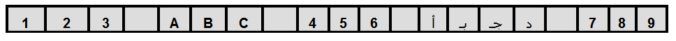
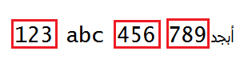
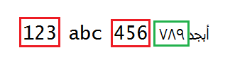
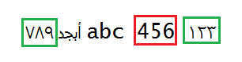
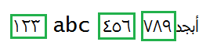
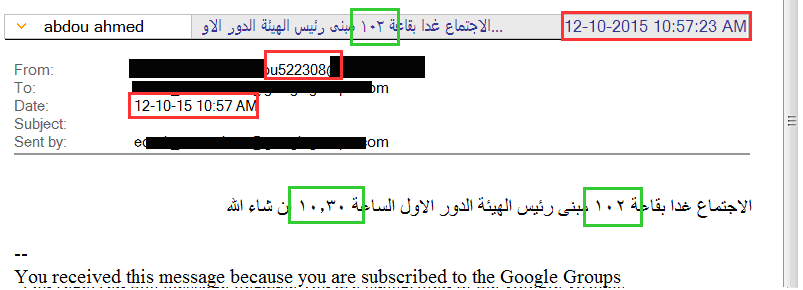
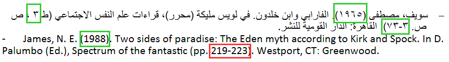
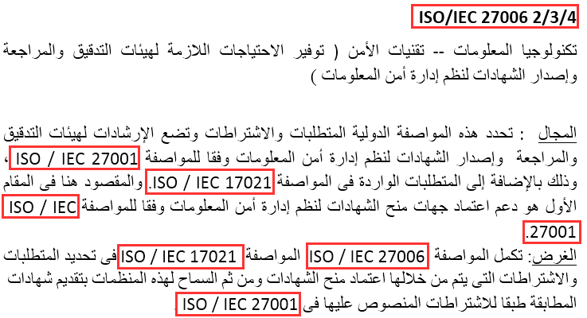

### Introduction to Arabic Numeric Shaping

Arabic and many other languages (Thai and Bengali) have classical shapes for digits “National Digits” that are different from the conventional Western Digits (European).

National digits have the same semantic meaning as the European digits, and the numbers they form are read from left to right (most significant digit on the left). The difference is only a difference in glyphs.

| European Digits | 0 | 1 | 2 | 3 | 4 | 5 | 6 | 7 | 8 | 9 |
| --------------- |----|---|---|---|---|---|---|---|---|---|
| **Arabic-Indic Digits** | ٠ |	١ |	٢ |	٣ |	٤ |	٥ |	٦ |	٧ |	٨ |	٩ |


From the Arabic user's point of view, Arabic-Indic numerals are the basic numerals used in almost all forms of documents such as most of government documents (IDs, birth certificates, driver's licenses, passports and household bills), bank statements, newspapers, calendars, road signs and menus.

<br>

### Options for Arabic Numeric Shaping

There are 3 options which should be taken into consideration when implementing national numeric shaping support in any framework/technology. These options are:

- **None**: No shaping is performed, and the value appears as it is in the data source.
- **National**: Digit shapes are determined from the user’s language.
- **Contextual**: Digit shapes are determined from the preceding characters in the buffer. European digits follow strong Latin character and Arabic-Indic digits follow strong Arabic character.
When there is no preceding strong characters, the base text direction attribute determines the digit shaping.(Arabic-Indic digits in RTL context and European digits in LTR context).


|**Pseudo Sample** | 123 abc 456 *ARABIC* 789 |
| -----------------|:-------------------------|
|**Arabic Sample** | 123 abc 456 أبجد 789|
|**Sample Buffer** ||

| Option | LTR Context | RTL Context |
| ------------ |----------|----------|
| None |  | Same as LTR. |
| Contextual |  |  |
| National |  | Same as LTR |
<br>

### Problem Statement

Most of the available frameworks/technologies lack the contextual shaping option of national digits. Contextual digit shaping is a very important feature as the Arabic users don’t expect to see Arabic-Indic numerals or European numerals only when they have mixed English and Arabic data. 

For example if a document has many paragraphs some in Arabic and others in English, in the Arabic paragraphs the Arabic users expect to see national or Arabic-Indic numerals, and in the English paragraphs the Arabic users expect to see European numerals.

Since the mixed English and Arabic data cases are very common in Arabic region, the same case with numerals is very common too.

|  |
|:--------------------------------:|
|Figure 1: Sample communication thread using IBM Lotus Notes|

||
|:----------------------------:|
|Figure 2: Sample Arabic and English list of references.|

Arabic paragraphs that list references’ names(which include numerals) are very common for Arabic users as well. In that case the Arabic users expect to see the numerals as European not Arabic-Indic.

||
|:----------------------------:|
|Figure 3: Sample Arabic paragraph where users expect to see European numerals.|
<br>

**_So direct conversion of digits from latin to national will not fulfil Arabic users’ needs.
Contextual behavior is the core numeric shaping option that is needed from the Arabic users’ point of view._**
<br> 

### Proposed Solution

As contextual digit shaping is very common and very important for Arabic users, it is highly advised to include this feature in the upcoming release of Ecma402 standard.

National digits shaping API could be added as a new property to the `Intl.NumberFormat` or `Intl` object.

The proposed API could look like this:

```javascript
new Intl.NumberShape("ar", {shaperType: "National", textDir: "rtl"}).shape("123 abc 456 أبجد 789");
//١٢٣ abc أبجد ٧٨٩ ٤٥٦  
new Intl.NumberShape("ar", {shaperType: "National", textDir: "ltr"}).shape("123 abc 456 أبجد 789");
//١٢٣ abc أبجد ٧٨٩ ٤٥٦  
new Intl.NumberShape("ar", {shaperType: "None", textDir: "rtl"}).shape("123 abc 456 أبجد 789");
//123 abc 456 أبجد 789
new Intl.NumberShape("ar", {shaperType: "None", textDir: "ltr"}).shape("123 abc 456 أبجد 789");
//123 abc 456 أبجد 789
new Intl.NumberShape("ar", {shaperType: "Contextual", textDir: "rtl"}).shape("123 abc 456 أبجد 789");
//١٢٣ abc أبجد ٧٨٩ 456
new Intl.NumberShape("ar", {shaperType: "Contextual", textDir: "ltr"}).shape("123 abc 456 أبجد 789");
//123 abc أبجد ٧٨٩ 456
```
<br>
Pseudo code for the proposed solution:
```java
 1. Initialize NumberShape object with locale and options.
 2. Call the shape function with string input text. 
 3. if options.shaperType == "None"
   3.1 No shaping is performed
 4. else if options.shaperType == "National"
   4.1 Substitute every Latin digit in the input text with the corresponding localized digit.
 5. else if options.shaperType == "Contextual"
   5.1 No shaping is performed for the digits that follow strong Latin letters.
   5.2 Substitute the Latin digits that follow strong national letters with the corresponding localized digits.
   5.3 if there is no strong letters then check the text direction.
     5.3.1 if textDir == "rtl"
       5.3.1.1 Substitute the Latin digits with the corresponding localized digits.
	 5.3.2 else 
	   3.3.2.1 No shaping is performed.
```


### How does Contextual Option Work

The contextual behavior is implemented by inspecting the preceding character in the buffer and determines the digit shapes based on it. European digits follow strong Latin character and Arabic-Indic digits follow strong Arabic character.
When there is no preceding strong characters, the base text direction attribute determines the digit shaping.(Arabic-Indic digits in RTL context and European digits in LTR context).
